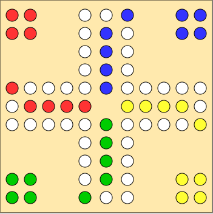

# Exploring MuZero on DOG

## Overview

This project explores the application of **MuZero** to complex board and card games, specifically focusing on **DOG** (a Swiss team card game) and its related games **Sorry!** and **Mensch ärgere dich nicht**. The primary research goal is to investigate how MuZero handles hidden information and team-based gameplay dynamics.

## MuZero Principle

MuZero is a model-based reinforcement learning algorithm developed by DeepMind that learns to master games without knowing their rules. It combines three key components:

- **Representation Function**: Encodes observations into a latent state
- **Dynamics Function**: Predicts next latent states and rewards
- **Prediction Function**: Estimates policy and value from latent states

Unlike traditional game-playing AI, MuZero learns an internal model of the game environment through self-play, enabling planning without requiring explicit game rules.

## Target Games

### Mensch ärgere dich nicht / Sorry!

Classic race board games where 2-4 players move pawns around a track based on dice/card draws. Players aim to move all pawns from start to home while potentially sending opponents' pawns back to start.

### DOG

A Swiss team card game (2v2) combining elements of Mensch ärgere dich nicht with card-based movement. Key features:

- **Team Play**: Players work in partnerships
- **Hidden Information**: Cards are private to each player
- **Card Exchange**: Partners exchange one card per round
- **Strategic Depth**: Card management and team coordination required

## Research Focus

This project addresses several challenges for MuZero:

- Handling **hidden information** (private cards)
- Modeling **team cooperation** between agents
- Learning **communication strategies** through card exchange
- Balancing individual and team objectives

## JAX and JIT Compilation

This implementation leverages **JAX**, a high-performance numerical computing library that provides automatic differentiation and XLA (Accelerated Linear Algebra) compilation. 

**Just-In-Time (JIT) compilation** is crucial for this project because:

- **Performance**: JIT compiles Python functions to optimized machine code, dramatically accelerating neural network operations and MCTS simulations
- **GPU/TPU Acceleration**: Seamlessly executes compiled code on accelerators without code changes
- **Vectorization**: Enables efficient batch processing of game states and neural network inference
- **Scalability**: Allows training MuZero through millions of self-play games in reasonable time

JAX's functional programming paradigm and JIT compilation make it ideal for implementing the computationally intensive components of MuZero, particularly the repeated neural network evaluations during Monte Carlo Tree Search.